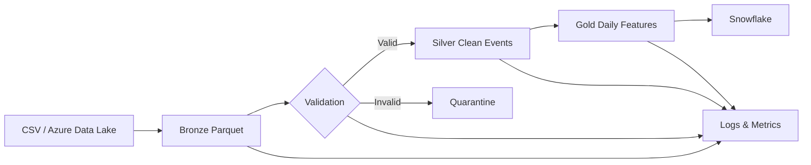

# Data Infrastructure for AI Systems

> An observable medallion data pipeline that ingests raw product events, validates data quality, transforms records into analytics-ready datasets, and publishes model-ready daily features.


## Project overview

AI systems fail when their data is late, duplicated, malformed or impossible to trace. This project demonstrates the data infrastructure behind reliable analytics and machine-learning workflows using a **Bronze → Silver → Gold** architecture.

The local implementation runs with Python and pandas, while the included Databricks notebook shows how the same pipeline boundaries translate to Spark and Delta Lake. A Snowflake loader is provided for publishing the final feature table.

## What it does

1. Generates or ingests event data from a CSV source.
2. Writes an immutable Bronze representation in Parquet.
3. Validates schema, primary keys, timestamps, null rates and accepted domains.
4. Sends invalid records to a run-specific quarantine dataset.
5. Cleans and standardises valid events into the Silver layer.
6. Aggregates daily user behaviour into a Gold feature table.
7. Emits structured JSON logs and stage-level pipeline metrics.
8. Optionally loads the Gold dataset into Snowflake.

## Architecture



## Gold feature table

| Column | Description |
|---|---|
| `event_date` | UTC calendar date |
| `user_id` | User identifier |
| `country` | Standardised country code |
| `event_count` | Total daily events |
| `purchase_count` | Daily purchases |
| `click_count` | Daily clicks |
| `total_value` | Daily transaction value |
| `unique_devices` | Distinct devices used |
| `last_event_at` | Most recent event timestamp |
| `conversion_rate` | Purchases divided by clicks |

## Repository structure

```text
.
├── configs/pipeline.yml
├── data/
│   ├── raw/
│   ├── bronze/
│   ├── silver/
│   └── gold/
├── docs/architecture.md
├── scripts/generate_sample_data.py
├── src/ai_data_platform/
│   ├── ingestion/
│   ├── transformation/
│   ├── validation/
│   ├── monitoring/
│   └── loaders/
├── tests/
├── databricks_notebook.py
├── Dockerfile
└── docker-compose.yml
```

## Run locally

```bash
python -m venv .venv
```

Windows:

```bash
.venv\Scripts\activate
```

macOS/Linux:

```bash
source .venv/bin/activate
```

Install and run:

```bash
pip install -e ".[dev]"
python scripts/generate_sample_data.py --rows 5000
ai-data-pipeline --config configs/pipeline.yml
```

Expected output:

```json
{
  "run_id": "aip-...",
  "bronze_rows": 5000,
  "silver_rows": 5000,
  "gold_rows": 1000,
  "rejected_rows": 0
}
```

## Run with Docker

```bash
docker compose up --build
```

## Test and lint

```bash
pytest --cov=ai_data_platform
ruff check src tests scripts
```

## Snowflake integration

Install the optional connector:

```bash
pip install -e ".[snowflake]"
```

Copy `.env.example` to `.env`, provide Snowflake credentials, and set `snowflake.enabled: true` in `configs/pipeline.yml`.

Credentials are read only from environment variables and are never committed.

## Databricks and Azure deployment path

The included `databricks_notebook.py` contains a Spark/Delta implementation suitable for adaptation into a Databricks Job. In a production Azure deployment:

- land raw files in Azure Data Lake Storage Gen2;
- use Auto Loader or Azure Data Factory for incremental ingestion;
- store Bronze, Silver and Gold tables in Delta Lake;
- schedule the notebook through Databricks Workflows;
- forward logs and alerts to Azure Monitor;
- publish Gold features to Snowflake or a feature store.

## Reliability features

- Configuration validation with Pydantic
- Duplicate primary-key detection
- Timestamp and accepted-domain checks
- Configurable null-rate thresholds
- Quarantine storage for rejected records
- Structured JSON logs containing run IDs
- Per-stage row counts, durations and rejection metrics
- Automated tests and GitHub Actions CI
- Secret-free Snowflake configuration

## Key engineering decisions

**Why medallion architecture?** It separates source fidelity, cleaning and business logic, making failures easier to isolate and datasets easier to replay.

**Why quarantine records?** Invalid data should remain inspectable instead of disappearing silently. Each rejected dataset is tied to a pipeline run ID.

**Why include both pandas and Spark?** Pandas keeps the project easy to run locally, while the Spark notebook demonstrates the distributed execution path expected in Databricks.

## Challenges addressed

- Maintaining data quality across ingestion and transformation stages
- Making failures observable through logs, metrics and run identifiers
- Preserving invalid records for debugging and replay
- Designing transformations that can move from local execution to distributed processing
- Keeping cloud credentials outside source control

## Lessons learned

- Reliable AI begins with reliable data contracts.
- Validation belongs at every system boundary, not only at the final table.
- Row counts, timing metrics and rejected-record samples make pipeline failures diagnosable.
- A scalable design is not only about compute; it also requires traceability, replayability and operational ownership.

## Future improvements

- Incremental ingestion and watermarking
- Great Expectations or Soda data-quality suites
- OpenLineage-compatible lineage events
- Prometheus/Grafana dashboards
- Azure Data Factory orchestration
- Databricks Unity Catalog governance
- Slowly changing dimensions and schema evolution
- Feature-store publication and model-training triggers

## Portfolio summary

**Data Infrastructure for AI Systems** is a data-engineering project exploring ingestion, transformation, validation and monitoring for scalable analytics and machine-learning systems. It demonstrates ETL design, distributed-processing patterns, cloud architecture, data-quality enforcement and observable pipeline operations.
