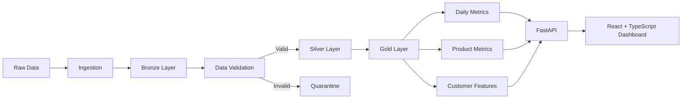

# DataForge

> A full-stack data engineering platform for ingesting, validating, transforming, monitoring, and exploring ecommerce event data through local and distributed Bronze → Silver → Gold pipelines.


DataForge demonstrates the infrastructure behind reliable analytics and machine-learning systems, from raw ingestion and data-quality enforcement to analytics-ready datasets, feature generation, observability, and interactive exploration.

---

## Overview

Modern AI and analytics systems depend on more than model performance. They require reliable data ingestion, validation, transformation, traceability, and monitoring.

DataForge implements these concerns using a medallion architecture:

```text
Raw Data
   ↓
Bronze
   ↓
Validation
   ├── Invalid → Quarantine
   ↓
Silver
   ↓
Gold
   ├── Daily Metrics
   ├── Product Metrics
   └── Customer Features
```

The project provides two processing paths:

- **Local pipeline:** Python + Pandas + Parquet
- **Distributed pipeline:** Databricks + PySpark + Delta Lake

A FastAPI backend exposes dataset operations, while a React and TypeScript dashboard provides an interface for exploring datasets, pipeline runs, quality results, lineage, quarantine records, analytics, and ML readiness.

---

## Dataset

DataForge uses the **Ecommerce Behavior Data from Multi-Category Store** dataset from Kaggle.

Dataset:

`mkechinov/ecommerce-behavior-data-from-multi-category-store`

The source contains ecommerce interaction events including:

| Column | Description |
|---|---|
| `event_time` | Timestamp of the interaction |
| `event_type` | View, cart, remove-from-cart or purchase |
| `product_id` | Product identifier |
| `category_id` | Product category identifier |
| `category_code` | Hierarchical product category |
| `brand` | Product brand |
| `price` | Product price |
| `user_id` | Customer identifier |
| `user_session` | Session identifier |

The complete October 2019 source contains several gigabytes of event data. Smaller samples are used for local development and the portfolio demo to keep the project reproducible and lightweight.

Raw datasets are intentionally excluded from Git.

---

## Architecture



---

## Processing modes

### Local processing

The local execution path uses:

```text
CSV
 ↓
Pandas
 ↓
Bronze Parquet
 ↓
Validation / Quarantine
 ↓
Silver Parquet
 ↓
Gold Parquet
```

This mode is designed for development, testing, API integration, and lightweight execution.

### Databricks processing

The distributed implementation uses:

```text
CSV
 ↓
PySpark
 ↓
Bronze Delta
 ↓
Validation
 ├── Quarantine Delta
 ↓
Silver Delta
 ↓
Gold Delta
 ├── Daily Metrics
 ├── Product Metrics
 └── Customer Features
```

The Databricks notebook was implemented and tested using Databricks, PySpark, and Delta Lake.

This demonstrates how the same logical pipeline can move from local dataframe processing to a distributed execution environment.

---

## Data quality

Validation occurs between the Bronze and Silver layers.

DataForge checks for issues including:

- missing timestamps;
- invalid timestamps;
- missing user identifiers;
- missing product identifiers;
- unsupported event types;
- invalid prices;
- duplicate ecommerce events;
- configurable null thresholds.

Invalid records are separated from trusted records instead of being silently discarded.

```text
Bronze
   │
   ▼
Validation
   │
   ├──────────────→ Quarantine
   │                 invalid records
   │
   ▼
Valid Records
   │
   ▼
Silver
```

This makes failures inspectable and allows rejected data to be analysed independently.

---

## Gold datasets

DataForge generates multiple analytics-ready Gold datasets rather than a single aggregate table.

### Daily metrics

Daily ecommerce behaviour including:

- views;
- cart events;
- purchases;
- revenue;
- active users;
- conversion rate;
- average order value.

### Product metrics

Product-level performance including:

- product ID;
- brand;
- category;
- views;
- cart events;
- purchases;
- revenue;
- unique users;
- conversion rate.

### Customer features

Customer-level behavioural features including:

- sessions;
- views;
- cart events;
- purchases;
- total spend;
- average order value;
- latest activity.

These outputs can support analytics dashboards as well as downstream machine-learning workflows.

---

## FastAPI backend

DataForge includes a FastAPI service for interacting with datasets and executing pipeline operations.

The API supports workflows such as:

```text
Upload Dataset
      ↓
Profile Dataset
      ↓
Validate Dataset
      ↓
Run Pipeline
      ↓
Explore Outputs
```

Example endpoints include:

```text
POST /api/datasets/upload

GET  /api/datasets/{dataset_id}/profile

POST /api/datasets/{dataset_id}/validate

POST /api/datasets/{dataset_id}/run
```

The API allows the frontend to interact with the data-engineering pipeline instead of functioning only as a static dashboard.

---

## Dashboard

The frontend is built with **React, TypeScript and Vite**.

DataForge provides interfaces for:

```text
Overview
│
├── DATA
│   ├── Datasets
│   ├── Data Explorer
│   └── Quarantine
│
├── PIPELINES
│   ├── Pipeline
│   ├── Pipeline Runs
│   ├── Data Lineage
│   └── Data Quality
│
├── INSIGHTS
│   ├── Analytics
│   └── ML Readiness
│
└── PLATFORM
    └── Architecture
```

The dashboard visualises pipeline outputs, quality information, processed datasets, execution history, lineage and analytics generated from the underlying ecommerce data.

---

## Repository structure

```text
.
├── configs/
│   └── pipeline.yml
│
├── data/
│   ├── raw/
│   ├── bronze/
│   ├── silver/
│   ├── gold/
│   └── quarantine/
│
├── frontend/
│   ├── public/
│   │   └── demo-data/
│   └── src/
│       ├── components/
│       ├── pages/
│       ├── services/
│       └── types/
│
├── scripts/
│   └── export_dashboard_data.py
│
├── src/
│   └── ai_data_platform/
│       ├── api/
│       ├── ingestion/
│       ├── transformation/
│       ├── validation/
│       ├── monitoring/
│       └── loaders/
│
├── tests/
│
├── databricks_notebook.py
├── Dockerfile
├── docker-compose.yml
├── pyproject.toml
└── README.md
```

---

## Run locally

### 1. Create the environment

```bash
python -m venv .venv
```

Windows:

```bash
.venv\Scripts\activate
```

Git Bash:

```bash
source .venv/Scripts/activate
```

macOS/Linux:

```bash
source .venv/bin/activate
```

### 2. Install dependencies

```bash
pip install -e ".[dev]"
```

### 3. Configure the dataset

The local configuration is stored in:

```text
configs/pipeline.yml
```

For example:

```yaml
paths:
  raw: data/raw/ecommerce/sample-100k.csv
```

### 4. Run the pipeline

```bash
ai-data-pipeline --config configs/pipeline.yml
```

A successful ecommerce run produces Bronze, Silver and Gold datasets together with quarantine records and pipeline metrics.

Example:

```json
{
  "run_id": "aip-bbd3d24d53",
  "bronze_rows": 100000,
  "silver_rows": 99983,
  "daily_rows": 1,
  "product_rows": 20621,
  "customer_rows": 20384,
  "rejected_rows": 17
}
```

---

## Run the API

Start the FastAPI development server:

```bash
uvicorn ai_data_platform.api.app:app --reload
```

The API can then be accessed locally at:

```text
http://localhost:8000
```

Interactive API documentation:

```text
http://localhost:8000/docs
```

---

## Run the frontend

```bash
cd frontend
npm install
npm run dev
```

For a production build:

```bash
npm run build
```

---

## Generate dashboard data

Pipeline outputs can be converted into lightweight JSON assets for the portfolio dashboard:

```bash
python scripts/export_dashboard_data.py --dataset ecommerce
```

Generated assets are consumed by the React frontend from:

```text
frontend/public/demo-data/
```

This allows the deployed portfolio demo to display representative pipeline results without shipping multi-gigabyte raw datasets.

---

## Databricks + PySpark + Delta Lake

`databricks_notebook.py` contains the distributed implementation of the DataForge ecommerce pipeline.

The notebook implements:

- Spark CSV ingestion;
- Bronze Delta tables;
- Spark-based validation;
- quarantine handling;
- Silver transformations;
- Gold daily metrics;
- Gold product metrics;
- Gold customer features;
- Delta Lake persistence.

The implementation mirrors the local pipeline while replacing Pandas and Parquet processing with PySpark and Delta Lake.

This provides a practical example of moving the same data architecture from local execution to distributed processing.

---

## Docker

The local environment can also be built using Docker:

```bash
docker compose up --build
```

---

## Testing

Run the automated test suite with:

```bash
pytest --cov=ai_data_platform
```

Lint the project with:

```bash
ruff check src tests scripts
```

---

## Observability

Pipeline execution records operational information including:

- run identifiers;
- pipeline stages;
- input row counts;
- output row counts;
- rejected rows;
- execution duration;
- validation warnings;
- pipeline completion status.

Example:

```text
pipeline_started
      ↓
ingestion
      ↓
validation
      ↓
silver_transform
      ↓
gold_daily
      ↓
gold_products
      ↓
gold_customers
      ↓
pipeline_completed
```

This makes individual pipeline executions traceable and easier to debug.

---

## Optional Snowflake connector

The project contains an optional Snowflake loading interface for publishing Gold-layer outputs.

Snowflake is **disabled by default** and is not required to run DataForge.

```yaml
snowflake:
  enabled: false
```

The portfolio implementation does not depend on a live Snowflake deployment.

---

## Cloud architecture

The current project implements distributed processing with Databricks, PySpark and Delta Lake.

A larger production deployment could extend the architecture with services such as:

- Azure Data Lake Storage Gen2 for durable data storage;
- Azure Data Factory or Databricks Auto Loader for incremental ingestion;
- Databricks Workflows for orchestration;
- Unity Catalog for governance;
- Azure Monitor for operational monitoring;
- Snowflake or a feature store for downstream serving.

These are architectural extension paths rather than dependencies of the current implementation.

---

## Reliability features

- Bronze → Silver → Gold medallion architecture
- Local and distributed processing paths
- Data validation before trusted transformations
- Quarantine handling for invalid records
- Duplicate-event detection
- Timestamp validation
- Event-domain validation
- Structured pipeline logging
- Run-level identifiers
- Stage-level row counts
- Execution-duration metrics
- Parquet-based local persistence
- Delta Lake distributed persistence
- API-driven dataset workflows
- Automated testing
- Raw-data exclusion from source control

---

## Key engineering decisions

**Why Bronze, Silver and Gold?**

Separating source fidelity, trusted data and business aggregates makes pipeline failures easier to isolate and transformations easier to reproduce.

**Why quarantine invalid records?**

Bad data should remain inspectable. Separating rejected records allows quality problems to be investigated without contaminating trusted datasets.

**Why Pandas and PySpark?**

Pandas provides a lightweight local development path. PySpark demonstrates how the same transformations can execute using distributed processing in Databricks.

**Why Parquet and Delta Lake?**

Parquet provides efficient local analytical storage, while Delta Lake adds table semantics suitable for the distributed Databricks execution path.

**Why expose the pipeline through an API?**

The API turns the pipeline into an application capability rather than a collection of standalone scripts. Datasets can be uploaded, profiled, validated and processed through a consistent interface.

---

## Challenges addressed

- Processing real-world ecommerce event data
- Handling duplicate and invalid records
- Maintaining clear boundaries between raw, trusted and analytical datasets
- Preserving rejected records for investigation
- Generating multiple analytics-ready Gold datasets
- Making pipeline execution observable
- Supporting both local and distributed execution
- Connecting data-engineering workflows to a web application
- Keeping large raw datasets out of Git

---

## Lessons learned

- Reliable analytics and AI systems depend on reliable upstream data.
- Validation is more useful when failed records remain inspectable.
- Medallion architecture provides clear boundaries for debugging and replay.
- Distributed processing changes execution mechanics without requiring the underlying data contracts to change.
- Operational metadata such as row counts, durations and run IDs is part of the data product, not an afterthought.
- Portfolio-scale applications can demonstrate production architecture without requiring production-scale infrastructure.

---

## Future improvements

- Incremental and streaming ingestion
- Watermarking and checkpointing
- Schema evolution
- Great Expectations or Soda quality suites
- OpenLineage-compatible events
- Databricks Workflows orchestration
- Unity Catalog governance
- Slowly changing dimensions
- Feature-store integration
- Model-training triggers
- Production cloud object storage
- Pipeline alerting and monitoring

---

## Portfolio summary

**DataForge** is a full-stack data engineering platform demonstrating how raw event data can be transformed into reliable analytics and machine-learning datasets.

It combines **Python, Pandas, FastAPI, React, TypeScript, PySpark, Databricks and Delta Lake** across local and distributed processing paths, with data-quality enforcement, quarantine handling, medallion architecture, observability, API-driven dataset operations and an interactive dashboard.