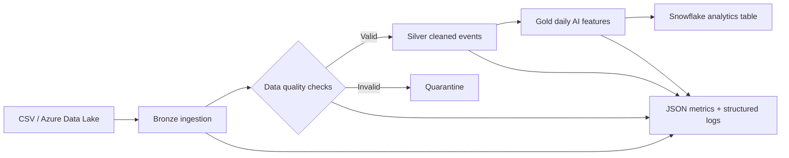

# Architecture

## Design decisions

- **Medallion architecture:** raw source data is retained, cleaned records are isolated from aggregates, and model-ready features are published separately.
- **Boundary validation:** schema, identity, timestamp, domain and null checks run before transformation.
- **Quarantine instead of silent deletion:** rejected records are persisted by run ID for investigation and replay.
- **Idempotent file outputs:** each layer is replaced deterministically for the local reference implementation.
- **Portable compute:** pandas provides a lightweight local execution path; the same transformation boundaries can be mapped to Spark DataFrames in Databricks.
- **Cloud-ready loading:** Snowflake integration is disabled by default and activated through configuration plus environment variables.
